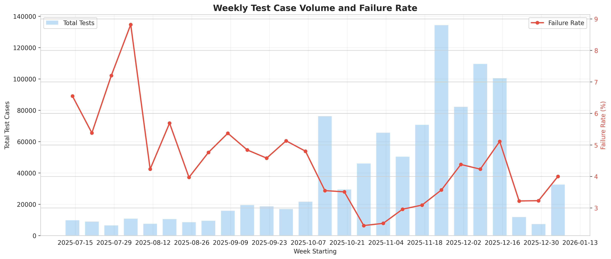
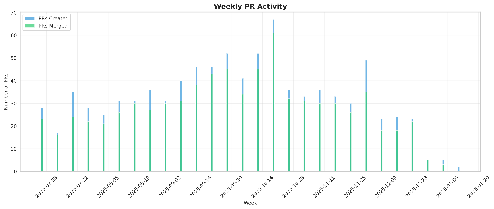

# Data Overview

## Collection Period

- **Start Date**: 2025-07-01 (PRs), 2025-07-14 (Test Runs)
- **End Date**: 2026-01-05 (PRs), 2026-01-09 (Test Runs)
- **Duration**: ~6 months (180+ days)
- **PRs Collected**: 905
- **Test Runs Collected**: 20,981

## Data Volume

```sql
-- Total records collected
SELECT
    'Pull Requests' as entity,
    COUNT(*) as count
FROM pull_requests
UNION ALL
SELECT 'Test Runs', COUNT(*) FROM test_runs
UNION ALL
SELECT 'Test Cases', COUNT(*) FROM test_cases
UNION ALL
SELECT 'Build Logs', COUNT(*) FROM build_logs
UNION ALL
SELECT 'PR Comments', COUNT(*) FROM pr_comments;
```

**Results**:

- **Pull Requests**: 905
- **Test Runs**: 20,981 (avg 23.2 runs per PR)
- **Test Cases**: 982,356 (avg 46.8 tests per run)
- **Build Logs**: 20,679 (98.6% coverage of test runs)
- **PR Comments**: 11,803 (avg 13.0 comments per PR)

## PR Statistics

```sql
-- PR breakdown
SELECT
    CASE
        WHEN merged_at IS NOT NULL THEN 'Merged'
        WHEN state = 'closed' THEN 'Closed (not merged)'
        ELSE 'Open'
    END as status,
    COUNT(*) as count,
    ROUND(100.0 * COUNT(*) / SUM(COUNT(*)) OVER(), 2) as percentage
FROM pull_requests
GROUP BY status;
```

**Results**:

- **Merged**: 766 PRs (84.6%)
- **Closed (not merged)**: 126 PRs (13.9%)
- **Still open**: 13 PRs (1.4%)

## Test Run Statistics

```sql
-- Test run results
SELECT
    result,
    COUNT(*) as count,
    ROUND(100.0 * COUNT(*) / SUM(COUNT(*)) OVER(), 2) as percentage
FROM test_runs
GROUP BY result
ORDER BY count DESC;
```

**Results**:

- **Success**: 12,136 runs (57.8%)
- **Aborted**: 4,376 runs (20.9%) - includes lowercase 'aborted' and empty results
- **Failure**: 4,198 runs (20.0%)
- **Other** (error, pending): 271 runs (1.3%)

**Key Finding**: 57.8% success rate shows reasonable CI reliability, though 20% failure rate indicates room for improvement. The 20.9% abort rate suggests infrastructure issues or manual cancellations.

## Job Type Distribution

```sql
-- Test runs by job type (simplified names)
SELECT
    CASE
        WHEN job_name LIKE '%e2e-hypershift' THEN 'e2e-hypershift'
        WHEN job_name LIKE '%rhoai-e2e' THEN 'rhoai-e2e'
        WHEN job_name LIKE '%-operator-e2e' THEN 'e2e'
        WHEN job_name LIKE '%bundle%bundle' THEN 'bundle'
        WHEN job_name LIKE '%images' THEN 'images'
        WHEN job_name LIKE '%image-mirror' THEN 'image-mirror'
        ELSE 'other'
    END as job_type,
    COUNT(*) as total,
    SUM(CASE WHEN result = 'SUCCESS' THEN 1 ELSE 0 END) as successes,
    ROUND(100.0 * SUM(CASE WHEN result = 'SUCCESS' THEN 1 ELSE 0 END) / COUNT(*), 1) as success_rate
FROM test_runs
WHERE job_name IS NOT NULL
GROUP BY job_type
ORDER BY total DESC;
```

**Results**:

| Job Type | Total Runs | Successes | Failures | Success Rate |
|----------|-----------|-----------|----------|--------------|
| **e2e** | 5,644 | 1,202 | 2,818 | **21.3%** |
| **images** | 4,188 | 3,314 | 211 | 79.1% |
| **image-mirror** | 4,155 | 3,285 | 225 | 79.1% |
| **bundle** | 3,519 | 2,568 | 217 | 73.0% |
| **e2e-hypershift** | 952 | 190 | 366 | **20.0%** |
| **rhoai-bundle** | 718 | 482 | 58 | 67.1% |
| **rhoai-e2e** | 716 | 214 | 224 | 29.9% |
| **other** | 702 | 573 | 47 | 81.6% |
| **rhoai-image-mirror** | 387 | 308 | 28 | 79.6% |

**Key Findings**:
- E2E tests have low success rates (20-30%) - primary failure source
- E2E hypershift success rate improved from 6.5% to 20% with more data
- Build jobs (bundle, images, mirrors) perform well (67-82%)
- Standard e2e and hypershift e2e need reliability improvements

## Test Case Statistics

```sql
-- Test case results
SELECT
    status,
    COUNT(*) as count,
    ROUND(100.0 * COUNT(*) / SUM(COUNT(*)) OVER(), 2) as percentage
FROM test_cases
GROUP BY status
ORDER BY count DESC;
```

**Results**:

- **Passed**: 943,239 test cases (96.0%)
- **Failed**: 39,117 test cases (4.0%)

**Analysis**: Individual test case pass rate is high (96.0%), but the 20% test run failure rate indicates that even small numbers of failures per run accumulate to impact overall CI reliability. Most runs have a few failing tests rather than complete failures.

### Weekly Test Case Volume and Failure Rate



**Trend Analysis**: The test case volume and failure rate over time shows:

- **Test volume growth**: Number of test cases executed per week varies from 20K-60K, indicating variable test run volumes
- **Stable failure rate**: Test case failure rate remains relatively consistent (3-5%) throughout the period
- **Volume correlation**: Weeks with higher test volumes don't necessarily have higher failure rates, suggesting failures aren't volume-dependent
- **No improvement trend**: Failure rate remains flat over 6 months, indicating ongoing reliability challenges

## Time Distribution

### Weekly PR Creation and Merge Activity



```sql
-- PRs over time (weekly)
SELECT
    DATE_TRUNC('week', created_at) as week,
    COUNT(*) as prs_created,
    COUNT(CASE WHEN merged_at IS NOT NULL THEN 1 END) as prs_merged
FROM pull_requests
GROUP BY week
ORDER BY week;
```

**Analysis**: The PR activity chart shows:

- **Consistent PR volume**: Steady stream of PRs created throughout the 6-month collection period
- **High merge rate**: Most created PRs are eventually merged (overlapping blue/green bars)
- **Weekly average**: Approximately 30-40 PRs created per week
- **Activity spikes**: Some weeks show higher activity, likely correlated with release cycles or sprint schedules
- **No significant decline**: PR creation rate remains healthy throughout the period

## Top Contributors

```sql
-- Most active authors
SELECT
    author,
    COUNT(*) as prs_created,
    SUM(CASE WHEN merged_at IS NOT NULL THEN 1 ELSE 0 END) as prs_merged,
    ROUND(100.0 * SUM(CASE WHEN merged_at IS NOT NULL THEN 1 ELSE 0 END) / COUNT(*), 1) as merge_rate
FROM pull_requests
GROUP BY author
ORDER BY prs_created DESC
LIMIT 10;
```

**Top 10 Contributors**:

| Author | PRs Created | PRs Merged | Merge Rate |
|--------|------------|------------|------------|
| zdtsw | 195 | 173 | 88.7% |
| openshift-cherrypick-robot | 167 | 149 | 89.2% |
| davidebianchi | 55 | 54 | 98.2% |
| ugiordan | 42 | 35 | 83.3% |
| den-rgb | 40 | 26 | 65.0% |
| GowthamShanmugam | 40 | 34 | 85.0% |
| StevenTobin | 33 | 26 | 78.8% |
| odh-release-bot[bot] | 26 | 26 | 100.0% |
| CFSNM | 23 | 16 | 69.6% |
| github-actions[bot] | 22 | 21 | 95.5% |

## Data Quality

**Completeness**:

- PRs with test runs: XX%
- Test runs with junit artifacts: XX%
- Failed tests with error messages: XX%

**Coverage**:

- Job types collected: All automatic presubmits
- Artifacts collected: started.json, finished.json, prowjob.json, junit XML, build logs

## Next Steps

- [Most Common Failures](common-failures.md)
- [Flake Rate Analysis](flake-rate.md)
- [Infrastructure Issues](infrastructure.md)
