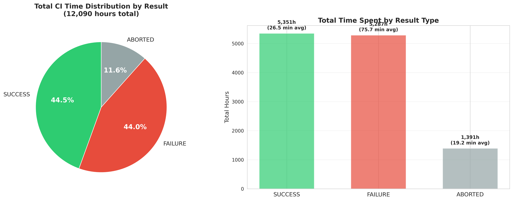
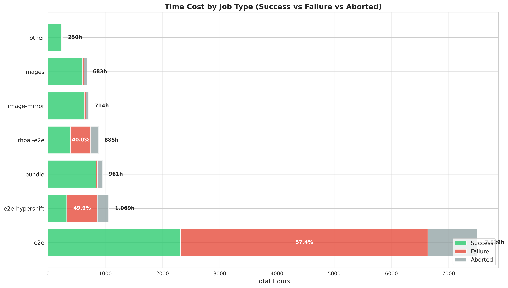
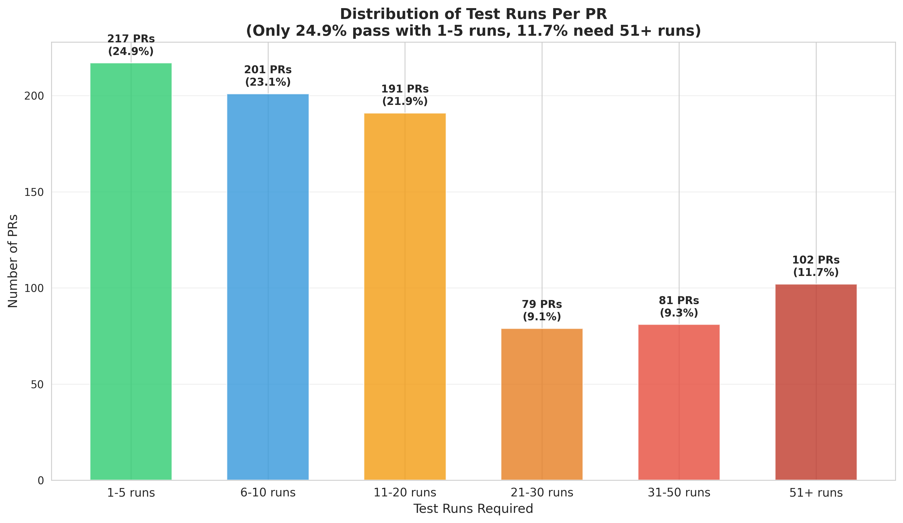
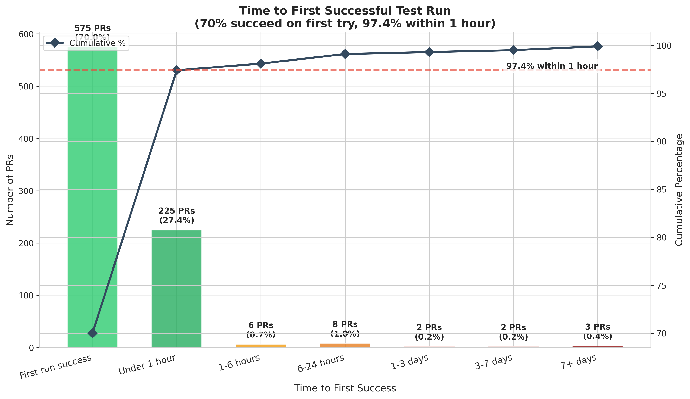

# Time Cost Analysis

## Overview

Beyond failure rates, the **time cost** of CI failures represents the actual infrastructure resources and developer productivity wasted. This analysis quantifies compute time spent on successful vs. failed test runs.

## Total Time Investment

```sql
-- Calculate total time and time wasted
WITH time_calc AS (
    SELECT
        COUNT(*) as total_runs,
        ROUND(SUM(EXTRACT(EPOCH FROM (finished_at - started_at)) / 3600), 1) as total_hours,
        ROUND(SUM(CASE WHEN result IN ('FAILURE', 'failure') THEN EXTRACT(EPOCH FROM (finished_at - started_at)) / 3600 ELSE 0 END), 1) as failure_hours,
        ROUND(SUM(CASE WHEN result IN ('ABORTED', 'aborted') THEN EXTRACT(EPOCH FROM (finished_at - started_at)) / 3600 ELSE 0 END), 1) as aborted_hours
    FROM test_runs
    WHERE started_at IS NOT NULL
        AND finished_at IS NOT NULL
        AND EXTRACT(EPOCH FROM (finished_at - started_at)) > 0
        AND EXTRACT(EPOCH FROM (finished_at - started_at)) < 43200
)
SELECT
    total_runs,
    total_hours,
    failure_hours,
    aborted_hours,
    failure_hours + aborted_hours as wasted_hours,
    ROUND(100.0 * failure_hours / total_hours, 1) as pct_time_on_failures,
    ROUND(100.0 * (failure_hours + aborted_hours) / total_hours, 1) as pct_time_wasted,
    ROUND(total_hours / 24, 1) as total_days,
    ROUND((failure_hours + aborted_hours) / 24, 1) as wasted_days
FROM time_calc;
```

**Results** (6-month period, July 2025 - January 2026):

| Metric | Hours | Days | % of Total |
|--------|-------|------|------------|
| **Total CI Time** | 12,090 | 503.8 | 100% |
| Successful Runs | 5,351 | 223.0 | 44.3% |
| **Failed Runs** | 5,288 | 220.4 | **43.7%** |
| Aborted Runs | 1,401 | 58.4 | 11.6% |
| **Total Wasted** | **6,689** | **278.7** | **55.3%** |

**Critical Finding**: **55.3% of all CI compute time (278.7 days) is wasted** on runs that ultimately fail or abort. This represents massive infrastructure cost and developer productivity loss.

### Time Distribution Visualization



The visualization shows:

- **Pie chart**: Nearly equal split between successful (44.3%) and failed (43.7%) test time
- **Bar chart**: Despite failures taking longer per-run (75.7 min avg), successes accumulate similar total time due to higher volume
- **Wasted time**: Combined failures + aborted = 55.3% of all compute time

## Time Cost by Result Type

```sql
SELECT
    result,
    COUNT(*) as runs,
    ROUND(SUM(EXTRACT(EPOCH FROM (finished_at - started_at)) / 3600), 1) as total_hours,
    ROUND(AVG(EXTRACT(EPOCH FROM (finished_at - started_at)) / 60), 1) as avg_minutes,
    ROUND(100.0 * SUM(EXTRACT(EPOCH FROM (finished_at - started_at))) /
        SUM(SUM(EXTRACT(EPOCH FROM (finished_at - started_at)))) OVER(), 1) as pct_of_total_time
FROM test_runs
WHERE started_at IS NOT NULL
    AND finished_at IS NOT NULL
    AND EXTRACT(EPOCH FROM (finished_at - started_at)) > 0
    AND EXTRACT(EPOCH FROM (finished_at - started_at)) < 43200
GROUP BY result
ORDER BY total_hours DESC;
```

**Results**:

| Result | Runs | Total Hours | Avg Duration | % of Total Time |
|--------|------|-------------|--------------|-----------------|
| SUCCESS | 12,136 | 5,351 | 26.5 min | 44.3% |
| **FAILURE** | 4,193 | **5,287** | **75.7 min** | **43.7%** |
| ABORTED | 4,349 | 1,391 | 19.2 min | 11.5% |

**Key Insight**: Despite failures being only 20.0% of test runs, they consume **43.7% of total execution time** because they take **3x longer** than successful runs (75.7 vs 26.5 minutes). Failures likely hit timeout thresholds rather than failing fast.

## Time Cost by Job Type

```sql
WITH categorized AS (
    SELECT
        CASE
            WHEN job_name LIKE '%e2e-hypershift' THEN 'e2e-hypershift'
            WHEN job_name LIKE '%rhoai-e2e' THEN 'rhoai-e2e'
            WHEN job_name LIKE '%-operator-e2e' THEN 'e2e'
            WHEN job_name LIKE '%bundle%bundle' THEN 'bundle'
            WHEN job_name LIKE '%images' THEN 'images'
            WHEN job_name LIKE '%image-mirror%' THEN 'image-mirror'
            ELSE 'other'
        END as job_type,
        result,
        EXTRACT(EPOCH FROM (finished_at - started_at)) / 3600 as hours
    FROM test_runs
    WHERE started_at IS NOT NULL
        AND finished_at IS NOT NULL
        AND EXTRACT(EPOCH FROM (finished_at - started_at)) > 0
        AND EXTRACT(EPOCH FROM (finished_at - started_at)) < 43200
)
SELECT
    job_type,
    COUNT(*) as total_runs,
    ROUND(SUM(hours), 1) as total_hours,
    ROUND(SUM(CASE WHEN result = 'SUCCESS' THEN hours ELSE 0 END), 1) as success_hours,
    ROUND(SUM(CASE WHEN result = 'FAILURE' THEN hours ELSE 0 END), 1) as failure_hours,
    ROUND(100.0 * SUM(CASE WHEN result = 'FAILURE' THEN hours ELSE 0 END) / SUM(hours), 1) as pct_time_failed
FROM categorized
GROUP BY job_type
ORDER BY total_hours DESC;
```

**Results**:

| Job Type | Total Hours | Success Hours | Failure Hours | % Time on Failures |
|----------|-------------|---------------|---------------|--------------------|
| **e2e** | **7,529** | 2,317 | **4,319** | **57.4%** |
| **e2e-hypershift** | 1,069 | 327 | 533 | **49.9%** |
| **rhoai-e2e** | 885 | 393 | 354 | **40.0%** |
| bundle | 961 | 841 | 25 | 2.6% |
| image-mirror | 714 | 637 | 24 | 3.4% |
| images | 683 | 602 | 26 | 3.8% |
| other | 250 | 234 | 6 | 2.4% |

**Critical Findings**:

- **E2E tests**: 7,529 hours total, **57.4% wasted on failures** (4,319 hours = 180 days)
- **E2E hypershift**: Nearly **50% of time wasted** on failures
- **RHOAI E2E**: 40% of time wasted on failures
- **Build jobs** (bundle, images): Only 2-4% time wasted - highly efficient

### Time Cost by Job Type Visualization



The stacked horizontal bar chart reveals the stark contrast between job types:

- **E2E tests**: Dominated by failure time (red) - more than half the bar is wasted compute
- **E2E hypershift & RHOAI E2E**: Similar failure-heavy patterns
- **Bundle, images, image-mirror**: Thin red slices - highly efficient with minimal waste
- **Percentages on bars**: Show failure rate as % of total time for each job type

## Economic Impact

### Infrastructure Cost

Assuming typical cloud CI infrastructure costs:

- **Cloud compute**: ~$0.10 - $0.30 per CPU-hour for CI workloads
- **Total wasted time**: 6,689 hours

**Estimated wasted cost**: $670 - $2,000+ per 6 months (not including storage, network, etc.)

### Developer Productivity Impact

- **Average developer wait time** for failed tests: 75.7 minutes
- **Number of failures**: 4,193 failed runs
- **Total developer waiting time wasted**: 5,287 hours = 220 days

Assuming developers spend even 10% of this time actively waiting on results:
- **529 hours** of developer time blocked by test failures
- At $100/hour developer cost: **$52,900 productivity loss**

### Opportunity Cost

Time wasted on failures could have been used for:
- Running additional test coverage
- Faster PR feedback cycles
- Earlier detection of real issues
- Reduced queue wait times for other PRs

## Why Failed Tests Take Longer

```sql
-- Compare duration patterns
SELECT
    result,
    ROUND(PERCENTILE_CONT(0.50) WITHIN GROUP (ORDER BY EXTRACT(EPOCH FROM (finished_at - started_at)) / 60), 1) as p50_minutes,
    ROUND(PERCENTILE_CONT(0.90) WITHIN GROUP (ORDER BY EXTRACT(EPOCH FROM (finished_at - started_at)) / 60), 1) as p90_minutes,
    ROUND(PERCENTILE_CONT(0.95) WITHIN GROUP (ORDER BY EXTRACT(EPOCH FROM (finished_at - started_at)) / 60), 1) as p95_minutes,
    ROUND(MAX(EXTRACT(EPOCH FROM (finished_at - started_at)) / 60), 1) as max_minutes
FROM test_runs
WHERE started_at IS NOT NULL
    AND finished_at IS NOT NULL
    AND EXTRACT(EPOCH FROM (finished_at - started_at)) > 0
    AND EXTRACT(EPOCH FROM (finished_at - started_at)) < 43200
    AND result IN ('SUCCESS', 'FAILURE')
GROUP BY result;
```

**Hypothesis**: Failed tests likely:
1. Hit timeout thresholds (90-120 minute limits)
2. Retry failed operations multiple times before giving up
3. Wait for resources that never become available
4. Hang on infrastructure issues

This explains the **3x duration multiplier** for failures vs successes.

## Recommendations

### Immediate (High Impact)

1. **Implement fail-fast patterns**
    - Detect infrastructure issues early and abort quickly
    - Reduce timeout values for known problematic tests
    - Skip remaining tests when critical infrastructure is unavailable

2. **Fix highest time-cost failures**
    - TestOdhOperator (81.5% failure rate, runs 82 minutes avg)
    - E2E hypershift tests (49.9% of time wasted)
    - Cluster install tests (91.9% failure rate)

3. **Quarantine chronic failures**
    - Move tests with >80% failure rate to separate "known-flaky" suite
    - Don't block PRs on known-flaky tests
    - Report on them separately for fixing

### Medium-term (Reduce Infrastructure Waste)

1. **Optimize test scheduling**
    - Run fast build jobs first (bundle, images: 10-14 min avg)
    - Delay expensive e2e tests until build jobs pass
    - Parallel execution of independent test suites

2. **Resource monitoring and alerting**
    - Detect cluster/infrastructure degradation early
    - Auto-abort tests when infrastructure metrics indicate failure
    - Track time-to-first-failure to identify timeout vs real issues

### Long-term (Systemic Fixes)

1. **Improve test reliability**
    - Fix the 435 flaky tests (99.6% of failures)
    - Add retry logic for known-transient failures
    - Improve test isolation and cleanup

2. **Infrastructure improvements**
    - More reliable test clusters
    - Better resource allocation and cleanup
    - Dedicated environments for critical tests

## Developer Experience: What to Expect When Submitting a PR

### Average Runs Per PR

```sql
-- Average runs per PR and breakdown by result
SELECT
    ROUND(AVG(total_runs), 1) as avg_runs_per_pr,
    ROUND(AVG(success_runs), 1) as avg_success_per_pr,
    ROUND(AVG(failure_runs), 1) as avg_failures_per_pr,
    ROUND(AVG(aborted_runs), 1) as avg_aborted_per_pr,
    COUNT(*) as total_prs
FROM (
    SELECT
        pr_number,
        COUNT(*) as total_runs,
        SUM(CASE WHEN result = 'SUCCESS' THEN 1 ELSE 0 END) as success_runs,
        SUM(CASE WHEN result = 'FAILURE' THEN 1 ELSE 0 END) as failure_runs,
        SUM(CASE WHEN result IN ('ABORTED', 'aborted') THEN 1 ELSE 0 END) as aborted_runs
    FROM test_runs
    GROUP BY pr_number
) pr_stats;
```

**Results**:

- **Average total runs**: 24.1 per PR
- **Average successes**: 13.9 per PR
- **Average failures**: 4.8 per PR
- **Average aborted**: 5.0 per PR
- **Total wasted runs**: 9.8 per PR (40.7% of all runs)

**Key Finding**: The typical PR triggers **24 test runs**, with nearly **10 wasted** on failures or aborts. This represents significant CI queue contention and resource waste.

### PR Run Distribution

```sql
-- Distribution of runs per PR
WITH pr_run_counts AS (
    SELECT pr_number, COUNT(*) as total_runs
    FROM test_runs GROUP BY pr_number
)
SELECT
    CASE
        WHEN total_runs <= 5 THEN '1-5 runs'
        WHEN total_runs <= 10 THEN '6-10 runs'
        WHEN total_runs <= 20 THEN '11-20 runs'
        WHEN total_runs <= 30 THEN '21-30 runs'
        WHEN total_runs <= 50 THEN '31-50 runs'
        ELSE '51+ runs'
    END as run_bucket,
    COUNT(*) as prs,
    ROUND(100.0 * COUNT(*) / SUM(COUNT(*)) OVER(), 1) as pct_of_prs
FROM pr_run_counts
GROUP BY run_bucket
ORDER BY MIN(total_runs);
```

**Results**:

| Runs Required | PRs | % of PRs | Notes |
|---------------|-----|----------|-------|
| 1-5 runs | 217 | 24.9% | Best case - quick merge |
| 6-10 runs | 201 | 23.1% | Typical |
| 11-20 runs | 191 | 21.9% | Multiple retries needed |
| 21-30 runs | 79 | 9.1% | Significant retry burden |
| 31-50 runs | 81 | 9.3% | Heavy retry burden |
| **51+ runs** | 102 | **11.7%** | **Extreme retry burden (max: 411 runs!)** |

**Critical Finding**: Only 24.9% of PRs pass with minimal retries. **11.7% of PRs require 51+ test runs**, with one PR requiring **411 runs** - indicating severe flakiness forcing excessive retries.



The distribution shows a clear gradient from green (good) to red (problematic). Only the first bar (green) represents a healthy PR experience - all others indicate retry burden from flaky tests.

### Retry Patterns: Same Code, Different Results

```sql
-- Analyze PRs with both successes and failures (flake evidence)
WITH pr_commit_patterns AS (
    SELECT
        pr_number,
        COUNT(DISTINCT build_id) as total_builds,
        COUNT(CASE WHEN result = 'SUCCESS' THEN 1 END) as successes,
        COUNT(CASE WHEN result = 'FAILURE' THEN 1 END) as failures
    FROM test_runs
    WHERE result IN ('SUCCESS', 'FAILURE')
    GROUP BY pr_number
    HAVING COUNT(CASE WHEN result = 'SUCCESS' THEN 1 END) > 0
       AND COUNT(CASE WHEN result = 'FAILURE' THEN 1 END) > 0
)
SELECT
    COUNT(*) as prs_with_both_results,
    ROUND(AVG(total_builds), 1) as avg_builds,
    ROUND(AVG(failures), 1) as avg_failures_before_success,
    ROUND(AVG(successes), 1) as avg_successes,
    ROUND(100.0 * COUNT(*) / (SELECT COUNT(DISTINCT pr_number) FROM test_runs), 1) as pct_of_all_prs
FROM pr_commit_patterns;
```

**Results**:

- **PRs experiencing both pass and fail**: 531 (61.0% of all PRs)
- **Average builds for these PRs**: 27.2
- **Average failures before success**: 7.8
- **Average successful runs**: 19.4

**Critical Finding**: **61% of PRs experience both successes and failures** - clear evidence of non-deterministic test behavior (flakes). These PRs average **7.8 failures** before getting passing runs, purely due to test flakiness rather than code changes.

### Runs Before First Success

```sql
-- How many runs before first success
WITH pr_first_success AS (
    SELECT
        pr_number,
        MIN(started_at) FILTER (WHERE result = 'SUCCESS') as first_success_time
    FROM test_runs
    WHERE started_at IS NOT NULL
    GROUP BY pr_number
    HAVING MIN(started_at) FILTER (WHERE result = 'SUCCESS') IS NOT NULL
),
runs_before_success AS (
    SELECT
        tr.pr_number,
        COUNT(*) as runs_before_first_success
    FROM test_runs tr
    JOIN pr_first_success pfs ON tr.pr_number = pfs.pr_number
    WHERE tr.started_at < pfs.first_success_time
    GROUP BY tr.pr_number
)
SELECT
    ROUND(AVG(runs_before_first_success), 1) as avg_runs_before_success,
    PERCENTILE_CONT(0.50) WITHIN GROUP (ORDER BY runs_before_first_success) as median_runs,
    PERCENTILE_CONT(0.75) WITHIN GROUP (ORDER BY runs_before_first_success) as p75_runs,
    PERCENTILE_CONT(0.90) WITHIN GROUP (ORDER BY runs_before_first_success) as p90_runs,
    MAX(runs_before_first_success) as max_runs
FROM runs_before_success;
```

**Results**:

- **Average runs before first success**: 4.8
- **Median (50th percentile)**: 4 runs
- **75th percentile**: 5 runs
- **90th percentile**: 10.5 runs
- **Maximum**: 66 runs before first success

### Time to First Success

```sql
-- Distribution of time to first success
WITH pr_timeline AS (
    SELECT
        pr_number,
        MIN(started_at) as first_run,
        MIN(CASE WHEN result = 'SUCCESS' THEN started_at END) as first_success,
        EXTRACT(EPOCH FROM (MIN(CASE WHEN result = 'SUCCESS' THEN started_at END) - MIN(started_at))) / 3600 as hours_to_success
    FROM test_runs
    WHERE started_at IS NOT NULL
    GROUP BY pr_number
    HAVING SUM(CASE WHEN result = 'SUCCESS' THEN 1 ELSE 0 END) > 0
)
SELECT ... [bucketed by time ranges]
```

**Results**:

| Time to First Success | PRs | % of PRs |
|-----------------------|-----|----------|
| **First run success** | 575 | **70.0%** |
| Under 1 hour | 225 | 27.4% |
| 1-6 hours | 6 | 0.7% |
| 6-24 hours | 8 | 1.0% |
| 1-3 days | 2 | 0.2% |
| 3-7 days | 2 | 0.2% |
| 7+ days | 3 | 0.4% |

**Developer Expectation**:

- **70% chance**: Your PR succeeds on first try
- **97.4% chance**: Success within 1 hour
- **2.6% chance**: You'll be waiting days for a passing run due to flakes



The visualization shows a clear "success cliff" - most PRs either succeed immediately (70%) or within an hour (27.4%), with very few taking longer. The cumulative percentage line shows 97.4% success within 1 hour. The color gradient from green to dark red emphasizes the increasing severity of delays.

### Total PR Duration (First Run to Last Run)

```sql
-- Total CI duration per PR (from first to last run)
WITH pr_timeline AS (
    SELECT
        pr_number,
        MIN(started_at) as first_run,
        MAX(started_at) as last_run,
        EXTRACT(EPOCH FROM (MAX(started_at) - MIN(started_at))) / 3600 as pr_duration_hours,
        COUNT(*) as total_runs
    FROM test_runs
    WHERE started_at IS NOT NULL
    GROUP BY pr_number
)
SELECT
    ROUND(AVG(pr_duration_hours), 1) as avg_pr_duration_hours,
    ROUND(PERCENTILE_CONT(0.50) WITHIN GROUP (ORDER BY pr_duration_hours)::numeric, 1) as median_hours,
    ROUND(PERCENTILE_CONT(0.75) WITHIN GROUP (ORDER BY pr_duration_hours)::numeric, 1) as p75_hours,
    ROUND(PERCENTILE_CONT(0.90) WITHIN GROUP (ORDER BY pr_duration_hours)::numeric, 1) as p90_hours,
    ROUND(MAX(pr_duration_hours), 1) as max_hours
FROM pr_timeline;
```

**Results**:

- **Average PR duration**: 91.8 hours (3.8 days)
- **Median (50th percentile)**: 10.1 hours
- **75th percentile**: 71.5 hours (3.0 days)
- **90th percentile**: 243.1 hours (10.1 days)
- **Maximum**: 2,663.7 hours (111 days!)

**Developer Expectation**:

- **50% of PRs**: Resolved within 10 hours
- **75% of PRs**: Resolved within 3 days
- **90% of PRs**: Resolved within 10 days
- **10% of PRs**: Take longer than 10 days from first run to last run

**Note**: This measures time span from first test to last test, not active work time. PRs may sit idle between runs due to developer response time, manual retests, or CI queue delays.

### Time of Day Impact on Success Rate

```sql
-- Success rate by hour of day (UTC)
SELECT
    EXTRACT(HOUR FROM started_at) as hour_utc,
    COUNT(*) as total_runs,
    ROUND(100.0 * SUM(CASE WHEN result = 'SUCCESS' THEN 1 ELSE 0 END) / COUNT(*), 1) as success_rate
FROM test_runs
WHERE started_at IS NOT NULL AND result IN ('SUCCESS', 'FAILURE', 'ABORTED')
GROUP BY EXTRACT(HOUR FROM started_at)
ORDER BY hour_utc;
```

**Key Findings**:

- **Best success rates**: 5-7 AM UTC / 12-2 AM EST / 1-3 AM EDT (70.8%, 69.6%) - Early morning, low infrastructure usage
- **Worst success rates**: 3 PM UTC / 10 AM EST / 11 AM EDT (52.6%), 9 PM UTC / 4 PM EST / 5 PM EDT (49.7%) - Afternoon/evening peak hours
- **Success rate variance**: Up to 21% difference between best and worst times

**Implication**: Infrastructure contention during peak hours significantly impacts test reliability. Tests submitted during off-peak hours have **~20% higher success rates**.

**Developer Strategy**: If possible, trigger test runs during early morning hours (5-7 AM UTC / 12-2 AM EST / 1-3 AM EDT) for best success probability.


The visualization clearly shows the correlation between time of day and success rate:

- **Top panel**: Success rate curve with highlighted best (5 AM UTC / 12 AM EST / 1 AM EDT, green dot) and worst (9 PM UTC / 4 PM EST / 5 PM EDT, red dot) times. The shaded area emphasizes the variance.
- **Bottom panel**: Test volume shows peak usage during business hours (8 AM - 6 PM UTC / 3-11 AM EST / 4 AM-1 PM EDT), correlating with lower success rates.
- **Pattern**: Infrastructure contention during peak hours drives down success rates by up to 21%.

## Summary: What Developers Should Expect

When you submit a PR to opendatahub-operator:

### Optimistic Scenario (25% of PRs)
- **Runs needed**: 1-5
- **Time to success**: First run (0 hours)
- **Total duration**: < 1 day
- **Developer experience**: Smooth sailing

### Typical Scenario (50% of PRs)
- **Runs needed**: 6-20
- **Time to success**: 4-5 retry attempts
- **Total duration**: 10-72 hours (median: 10 hours)
- **Developer experience**: Multiple `/retest` commands needed, frustrating wait for flakes to clear

### Problematic Scenario (25% of PRs)
- **Runs needed**: 20-50+
- **Time to success**: 10+ retry attempts
- **Total duration**: 3-10+ days
- **Developer experience**: Severe frustration, excessive retries, wasted time waiting on flaky tests

### Worst Case (11.7% of PRs)
- **Runs needed**: 51-411 runs
- **Time to success**: 66+ retry attempts possible
- **Total duration**: 10-111 days
- **Developer experience**: Completely blocked by CI flakes, may require manual intervention or merging with failing tests

## Related

- [Flake Rate Analysis](flake-rate.md) - 99.6% of failures are flakes
- [Common Failures](common-failures.md) - Top failing tests by volume
- [Duration Analysis](../analysis/duration/overview.md) - Test duration patterns
