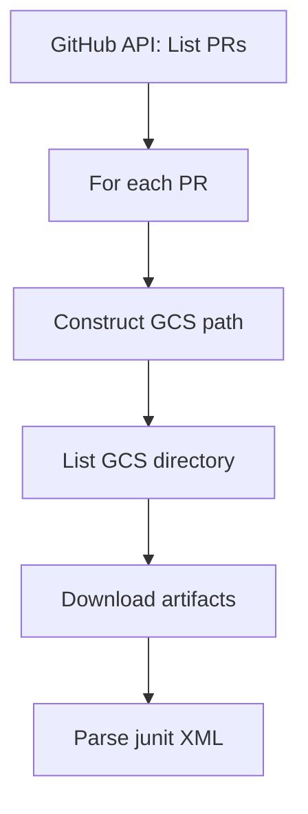
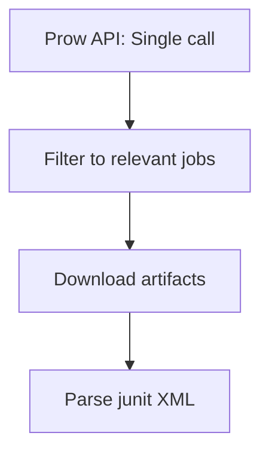

# Prow JSON API

## Overview

Prow exposes a JSON API endpoint that provides real-time access to recent test jobs. This offers a faster alternative to scanning GCS buckets for discovering test runs and their metadata.

**Use Case**: Efficient discovery of recent test runs without GitHub API calls or GCS directory listings.

## Endpoint

```
https://prow.ci.openshift.org/prowjobs.js
```

**Method**: GET
**Authentication**: None required (public endpoint)
**Response Format**: JSON

## Query Parameters

| Parameter | Description | Recommended Value |
|-----------|-------------|-------------------|
| `omit` | Comma-separated fields to exclude from response | `annotations,labels,decoration_config,pod_spec` |
| `var` | Wrap response in JavaScript variable (omit for pure JSON) | *(omit this parameter)* |

!!! tip "Reduce Payload Size"
    Always use `omit=annotations,labels,decoration_config,pod_spec` to reduce payload from ~15MB to ~3MB.

## Dataset Characteristics

Based on testing (January 2026):

- **Total jobs**: ~28,000 jobs across all OpenShift repositories
- **Time window**: Approximately 24-48 hours of recent activity
- **Update frequency**: Real-time (updated as jobs complete)
- **opendatahub-operator**: ~180 jobs in 21-hour window

!!! warning "Time Window Limitation"
    API only contains 24-48 hours of data. For historical analysis, use GitHub API + GCS bucket approach.

## Response Structure

### Top Level

```json
{
  "items": [
    { /* ProwJob object 1 */ },
    { /* ProwJob object 2 */ },
    ...
  ]
}
```

### ProwJob Object

Each item represents a Kubernetes ProwJob custom resource with three main sections:

1. **Metadata Section**

    ```json
    {
      "metadata": {
        "name": "07a3aa1a-3086-4a7e-90c7-8750476f13d1",
        "namespace": "ci",
        "uid": "058d58e5-6c25-486a-96a4-bed275d144d5",
        "creationTimestamp": "2026-01-12T22:02:38Z"
      }
    }
    ```

    Key Fields:

    - `name`: Unique job identifier (UUID)
    - `namespace`: Kubernetes namespace (typically "ci")
    - `creationTimestamp`: ISO 8601 timestamp when job was created

2. **Spec Section (Job Configuration)**

    ```json
    {
      "spec": {
        "type": "presubmit",
        "agent": "kubernetes",
        "cluster": "build08",
        "job": "pull-ci-opendatahub-io-opendatahub-operator-main-opendatahub-operator-e2e",
        "refs": {
          "org": "opendatahub-io",
          "repo": "opendatahub-operator",
          "repo_link": "https://github.com/opendatahub-io/opendatahub-operator",
          "base_ref": "main",
          "base_sha": "0efd954837d63855de7053d98d36f803b9a08167",
          "pulls": [
            {
              "number": 3048,
              "author": "jctanner",
              "sha": "4798870ff05c34b05c307dc5ddad12e64a7b8d10",
              "title": "[DO NOT MERGE] prow validation",
              "head_ref": "CI_PROW_EVALUATION",
              "link": "https://github.com/opendatahub-io/opendatahub-operator/pull/3048"
            }
          ]
        },
        "context": "ci/prow/opendatahub-operator-e2e",
        "rerun_command": "/test opendatahub-operator-e2e"
      }
    }
    ```

    **Key Spec Fields**:

    | Field | Type | Description |
    |-------|------|-------------|
    | `type` | string | Job type: `presubmit`, `postsubmit`, `periodic`, `batch` |
    | `agent` | string | Execution agent: `kubernetes`, `jenkins`, `tekton-pipeline` |
    | `cluster` | string | Build cluster identifier (`build01` - `build08`) |
    | `job` | string | Full job name |
    | `refs.org` | string | GitHub organization |
    | `refs.repo` | string | GitHub repository name |
    | `refs.base_ref` | string | Base branch (e.g., `main`) |
    | `refs.base_sha` | string | Base commit SHA |
    | `refs.pulls[]` | array | Pull request objects (for presubmit jobs) |
    | `refs.pulls[].number` | integer | PR number |
    | `refs.pulls[].author` | string | PR author GitHub username |
    | `refs.pulls[].sha` | string | PR commit SHA |
    | `refs.pulls[].title` | string | PR title |
    | `context` | string | GitHub status context name |
    | `rerun_command` | string | Slash command to rerun job |

3. **Status Section (Job Results)**

    ```json
    {
      "status": {
        "startTime": "2026-01-12T22:02:38Z",
        "completionTime": "2026-01-12T23:38:44Z",
        "state": "failure",
        "description": "Job failed.",
        "url": "https://prow.ci.openshift.org/view/gs/test-platform-results/pr-logs/pull/opendatahub-io_opendatahub-operator/3048/pull-ci-opendatahub-io-opendatahub-operator-main-opendatahub-operator-e2e/2010834832447246336",
        "build_id": "2010834832447246336",
        "pod_name": "07a3aa1a-3086-4a7e-90c7-8750476f13d1"
      }
    }
    ```

    **Key Status Fields**:

    | Field | Type | Description |
    |-------|------|-------------|
    | `state` | string | `success`, `failure`, `pending`, `triggered`, `aborted`, `error` |
    | `startTime` | string | ISO 8601 timestamp when job started |
    | `completionTime` | string | ISO 8601 timestamp when completed (null if running) |
    | `description` | string | Human-readable status message |
    | `url` | string | **Direct link to GCS artifacts/Spyglass viewer** |
    | `build_id` | string | Unique build identifier |
    | `pod_name` | string | Kubernetes pod name that executed the job |

## Extracting GCS Paths

The `status.url` field provides a direct link to job artifacts. Convert it to different formats:

=== "Spyglass URL (provided)"
    ```
    https://prow.ci.openshift.org/view/gs/test-platform-results/pr-logs/pull/opendatahub-io_opendatahub-operator/3048/pull-ci-opendatahub-io-opendatahub-operator-main-opendatahub-operator-e2e/2010834832447246336
    ```

=== "GCS Path"
    ```python
    gcs_path = url.replace(
        "https://prow.ci.openshift.org/view/gs/",
        "gs://"
    )
    # Result: gs://test-platform-results/pr-logs/pull/...
    ```

=== "HTTP Storage URL"
    ```python
    http_path = url.replace(
        "https://prow.ci.openshift.org/view/gs/",
        "https://storage.googleapis.com/"
    )
    # Result: https://storage.googleapis.com/test-platform-results/pr-logs/pull/...
    ```

## Example Usage

### Basic Query

```bash
# Get total job count
curl -s "https://prow.ci.openshift.org/prowjobs.js?omit=annotations,labels,decoration_config,pod_spec" | \
  jq '.items | length'
# Output: 28126
```

### Filter by Repository

```bash
# Count opendatahub-operator jobs
curl -s "https://prow.ci.openshift.org/prowjobs.js?omit=annotations,labels,decoration_config,pod_spec" | \
  jq '[.items[] | select(.spec.refs.repo == "opendatahub-operator")] | length'
# Output: 180
```

### Find Failed Jobs

```bash
# Get all failed opendatahub-operator jobs
curl -s "https://prow.ci.openshift.org/prowjobs.js?omit=annotations,labels,decoration_config,pod_spec" | \
  jq '[.items[] | select(.spec.refs.repo == "opendatahub-operator" and .status.state == "failure")]'
```

### Extract PR Numbers

```bash
# List unique PR numbers with recent test runs
curl -s "https://prow.ci.openshift.org/prowjobs.js?omit=annotations,labels,decoration_config,pod_spec" | \
  jq -r '.items[] | select(.spec.refs.repo == "opendatahub-operator") | .spec.refs.pulls[]?.number' | \
  sort -u
```

## Python Integration

### Basic Fetcher Function

```python
import requests
from datetime import datetime, timedelta
from typing import List, Dict, Optional

def fetch_prow_jobs(
    repo: str = "opendatahub-operator",
    org: str = "opendatahub-io",
    hours: int = 24,
    states: Optional[List[str]] = None
) -> List[Dict]:
    """
    Fetch recent Prow jobs for a repository.

    Args:
        repo: Repository name
        org: Organization name
        hours: How many hours back to look
        states: Filter by job states (e.g., ["failure", "error"])

    Returns:
        List of job dictionaries with extracted metadata
    """
    url = "https://prow.ci.openshift.org/prowjobs.js"
    params = {"omit": "annotations,labels,decoration_config,pod_spec"}

    response = requests.get(url, params=params)
    response.raise_for_status()
    data = response.json()

    jobs = []
    cutoff = datetime.utcnow() - timedelta(hours=hours)

    for item in data["items"]:
        # Check repo match
        refs = item.get("spec", {}).get("refs", {})
        if refs.get("repo") != repo or refs.get("org") != org:
            continue

        # Check state filter
        state = item["status"]["state"]
        if states and state not in states:
            continue

        # Parse timestamps
        start_time = datetime.fromisoformat(
            item["status"]["startTime"].replace("Z", "+00:00")
        )

        # Check time filter
        if start_time < cutoff:
            continue

        # Extract PR info
        pulls = refs.get("pulls", [])
        pr_info = pulls[0] if pulls else {}

        # Extract GCS path from URL
        gcs_url = item["status"]["url"]
        gcs_path = gcs_url.replace(
            "https://prow.ci.openshift.org/view/gs/",
            "gs://"
        )

        # Build job metadata
        job_data = {
            "pr_number": pr_info.get("number"),
            "pr_author": pr_info.get("author"),
            "pr_title": pr_info.get("title"),
            "pr_sha": pr_info.get("sha"),
            "job_name": item["spec"]["job"],
            "job_type": item["spec"]["type"],
            "state": state,
            "build_id": item["status"]["build_id"],
            "cluster": item["spec"].get("cluster"),
            "start_time": item["status"]["startTime"],
            "completion_time": item["status"].get("completionTime"),
            "gcs_path": gcs_path,
            "prow_url": gcs_url,
            "base_ref": refs.get("base_ref"),
            "base_sha": refs.get("base_sha"),
        }

        jobs.append(job_data)

    return jobs
```

### Example Usage

```python
# Get all recent jobs
all_jobs = fetch_prow_jobs(repo="opendatahub-operator")
print(f"Found {len(all_jobs)} recent jobs")

# Get only failures
failures = fetch_prow_jobs(
    repo="opendatahub-operator",
    states=["failure", "error"]
)
print(f"Found {len(failures)} failures")

# Show details for first failure
if failures:
    job = failures[0]
    print(f"\nFailed Job Example:")
    print(f"  PR #{job['pr_number']}: {job['pr_title']}")
    print(f"  Job: {job['job_name']}")
    print(f"  Build ID: {job['build_id']}")
    print(f"  GCS Path: {job['gcs_path']}")
```

## Comparison: Current vs API-Based Approach

### Current Approach (GitHub + GCS)



**Steps**: GitHub → Construct paths → List GCS → Download → Parse

### Improved Approach (Prow API + GCS)



**Steps**: Prow API → Filter → Download → Parse

### Benefits Comparison

| Aspect | GitHub + GCS | Prow API + GCS | Improvement |
|--------|-------------|----------------|-------------|
| **API Calls** | N GitHub calls + M GCS listings | 1 Prow call | **10-100x fewer** |
| **PR Metadata** | Separate GitHub calls | Included in response | **No extra calls** |
| **Job Discovery** | List GCS directories | Pre-indexed in API | **Much faster** |
| **State Filtering** | Download first, check later | Filter before download | **Less bandwidth** |
| **GCS Paths** | Manual construction | Provided directly | **No errors** |
| **Timing Data** | Parse from artifacts | Included in response | **Immediate** |
| **Real-time** | GitHub sync delay | Real-time updates | **More current** |

### Limitations

| Limitation | Impact | Mitigation |
|------------|--------|------------|
| **24-48 hour window** | Can't fetch old data | Use GitHub+GCS for historical |
| **No junit details** | Still need artifacts | Download from GCS path provided |
| **No log content** | Still need build logs | Download from GCS path provided |
| **No test case data** | Only job pass/fail | Parse junit XML from GCS |

## Recommended Hybrid Strategy

1. **Recent Data Collection (< 48 hours)**

    Use Prow API for fast discovery, then download artifacts:

    ```python
    # Fetch recent jobs from Prow API
    recent_jobs = fetch_prow_jobs(repo="opendatahub-operator", hours=24)

    # Filter to jobs of interest (e.g., e2e tests only)
    e2e_jobs = [j for j in recent_jobs if "e2e" in j["job_name"]]

    # Download artifacts from GCS for each job
    for job in e2e_jobs:
        # Skip if already processed
        if build_exists_in_db(job["build_id"]):
            continue

        # Download and parse
        download_junit_xml(job["gcs_path"])
        download_build_logs(job["gcs_path"])
        parse_and_store(job)
    ```

2. **Historical Data Collection (> 48 hours)**

    Use existing GitHub + GCS approach:

    ```python
    # For data older than API window
    for pr in get_prs_in_date_range(start_date, end_date):
        for build in find_builds_for_pr(pr):
            download_and_parse_artifacts(build)
    ```

3. **Continuous Monitoring**

    Poll Prow API for real-time collection:

    ```python
    import time

    def monitor_prow_jobs():
        """Continuously monitor for new test runs."""
        while True:
            # Get jobs from last hour
            new_jobs = fetch_prow_jobs(hours=1)

            for job in new_jobs:
                # Skip already processed
                if not already_processed(job["build_id"]):
                    process_job(job)
                    mark_processed(job["build_id"])

            # Wait 5 minutes before next check
            time.sleep(300)

    # Run continuous monitoring
    monitor_prow_jobs()
    ```

## Integration with CI Audit System

### Benefits for CI Audit Project

1. **Faster Worker Discovery**
    - Workers can query Prow API instead of listing GCS directories
    - Reduces load on GCS bucket
    - Faster work queue population

2. **Real-time Monitoring**
    - Continuously process new test runs as they complete
    - Near-instant failure notifications
    - Live dashboard updates

3. **Incremental Collection**
    - Use `build_id` to avoid re-processing
    - Efficient delta collection
    - Lower database load

4. **Enhanced Metadata**
    - Cluster assignment information
    - Exact timing without parsing
    - Rerun commands for automation

### Proposed Implementation

Add a new `ProwAPICollector` class:

```python
class ProwAPICollector:
    """Collector for Prow API endpoint."""

    def __init__(self, org: str, repo: str):
        self.org = org
        self.repo = repo
        self.api_url = "https://prow.ci.openshift.org/prowjobs.js"

    def fetch_recent_jobs(self, hours: int = 24) -> List[Dict]:
        """Fetch recent jobs from Prow API."""
        # Implementation from example above
        pass

    def get_new_builds(self, db_session) -> List[Dict]:
        """Get builds not yet in database."""
        jobs = self.fetch_recent_jobs()

        # Filter to builds not in DB
        existing_builds = get_existing_build_ids(db_session)
        new_jobs = [j for j in jobs if j["build_id"] not in existing_builds]

        return new_jobs
```

## Rate Limiting & Best Practices

No explicit rate limiting observed, but follow best practices:

- **Cache responses** when possible
- **Reasonable polling**: 5+ minute intervals for continuous monitoring
- **Exponential backoff** on errors
- **Monitor payload size**: Use `omit` parameter consistently
- **Track processed builds**: Use `build_id` to avoid duplicates

## Related Documentation

- [Prow Architecture](architecture.md) - General Prow overview
- [GCS Artifacts](artifacts.md) - Artifact structure and access
- [Job Types](job-types.md) - Understanding different job types
- [Database Schema](../setup/database-schema.md) - Storing Prow data

## External Resources

- [Prow Documentation](https://docs.prow.k8s.io/)
- [OpenShift Prow Instance](https://prow.ci.openshift.org)
- [Spyglass Viewer](https://docs.prow.k8s.io/docs/spyglass/) - Artifact viewer UI
